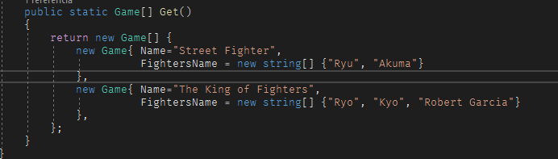

# Shoto Fighters Factory
## Projeto lista fighting games, seus shotos fighters e seus golpes
Projeto motivado pelo estudo do Design Pattern Abstract Method e Simple Factory

O objetivo principal é ter a flexibilidade de adicionar um novo personagem ou uma nova fábrica sem alterar o código existente.

#Como incluir um novo personagem

Criar a classe do novo personagem

Adicionar a opção para criar novo personagem na sua fábrica

Adicionar a nova entrada para listar no form (Obs.: preciso refatorar essa parte)

Form com o novo personagem adicionado.

## Tecnologias utilizadas

- Dotnet 7
- Windows Forms para UI
- xUnit

## Boas práticas e padrões utilizados

- Solid
- Abstract Method
- Simple Factory
- DRY
- Clean Code
- Null Object Pattern

## License

MIT

**Free Software, Hell Yeah!**